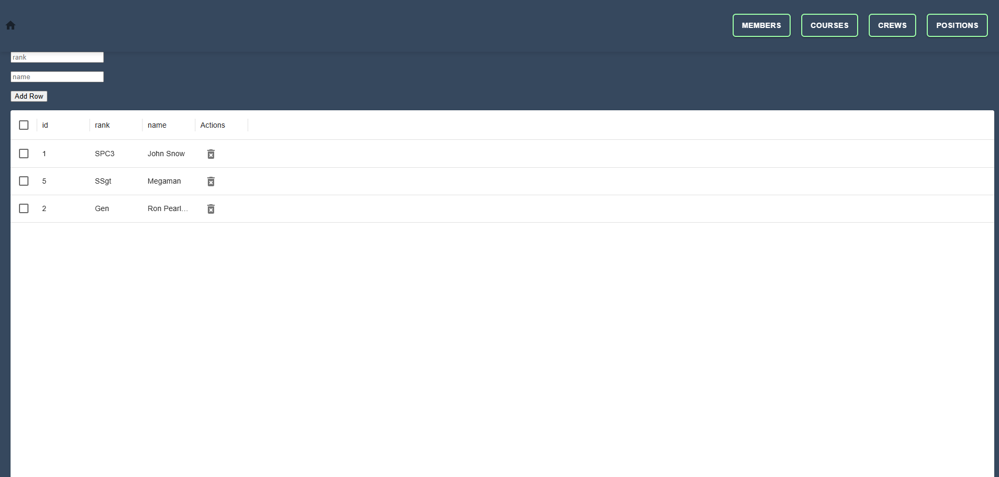
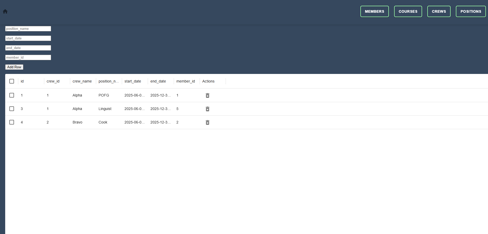
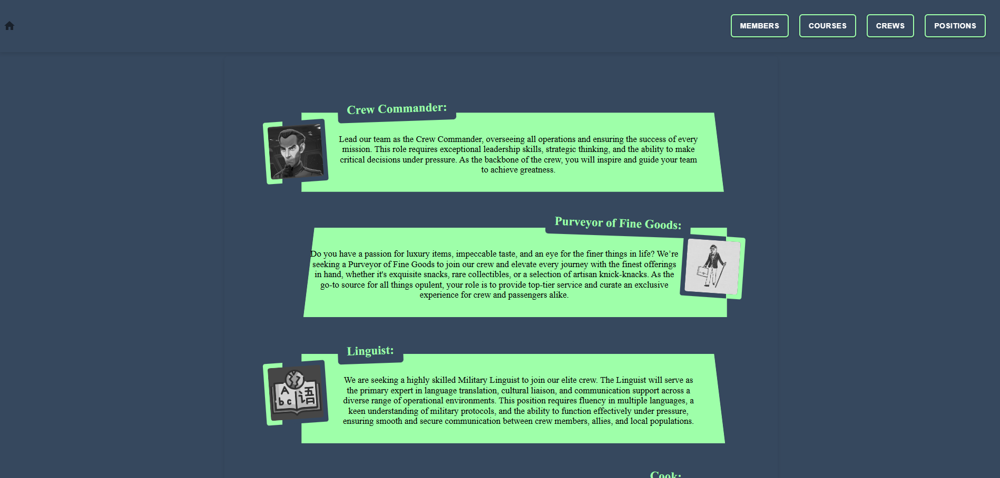

# Malicious Vanquishers of Evil (MVOE) Scheduling Tool

**MVOE Scheduling Tool** vanquishes the evil of difficult scheduling. With computing powers combined you are now able quickly and easily inprocess new members to your squadron by adding them to the roster on the **Members** page.

Once a new member is added, you can assign them to their training pipeline for one of their eventual crew positions: **Crew Commander**, **Purveyor of Fine Goods**, **Linguist**, **Cook**, **Deckhand**, **Space Surgeon**, or **Engineer**. You can also check out the **Positions** page to get a description of each crew position.

To create a new course, check out the **Courses** page and click the **Add Course** button to put a new course on the timeline. If you need more detail, or detail at a glance, scroll down to the **Courses Information** section. Also in that section, you can delete or edit a course by clicking the respective icons!!

---
##  Problem Statement

Unit schedulers are struggling to deconflict schedules between courses and crew rotations due to the complex and extensive course requirements. Courses range from 2 to 6 months, and the current reliance on three separate systems for tracking availability leads to scheduling errors and delays, impacting mission readiness.

Our solution is to create a crew scheduling tool that enables scheduling managers to visualize ongoing and upcoming courses and track availability based on course completion. This tool will allow schedulers to efficiently build crews for different time periods by ensuring individuals meet the necessary course requirements for their assigned positions.

---##  Run Locally

### 📦 Install dependencies

```bash
npm install
```

###  Clone the repository

```bash
git clone https://github.com/curtisbonham/SDI-Project-3.git
cd SDI-Project-3
```

###  Docker setup

Download and install [Docker](https://docs.docker.com/get-started/get-docker/)

###  Navigate to the server directory

```bash
cd server
```

###  Run the setup script and follow the prompts

```bash
./setup.sh
```

> If you get a permission error, run: `chmod +x setup.sh`

###  Start the client

```bash
npm run dev --prefix ./client
```

###  Open a new terminal and start the server

```bash
npm run dev --prefix ./server
```

---### 1. Clone the Repository

```bash
git clone https://github.com/curtisbonham/SDI-Project-3.git
cd SDI-Project-3

```

##  Running Tests

To run tests, make sure you are in the server or client directory, then run:

```bash
npm run test
```

---## ✅ Running Tests

To run tests, make sure you are in the server or client directory, then run the following command:

```bash
  npm run test
```

---## 🛠 Common Issues

When running `./setup.sh`, you may encounter one of these errors:

**❌ Error:**

-   `bash: ./setup.sh: Permission denied`

-   `bash: Unknown command. './setup.sh' exists but is not an executable file.`

**Solution:**
Run the following command to grant execute permissions to the setup script:

```bash
  chmod +x setup.sh
```

---
## 🗂️ Project Structure

```
SDI-Project-3/
├── client/                     # Frontend (React + Vite)
│   ├── coverage/               # Code coverage output
│   ├── public/                 # Static assets
│   ├── src/                    # React components and logic
│   ├── Dockerfile              # Frontend Docker configuration
│   ├── eslint.config.js        # ESLint configuration
│   ├── index.html              # HTML template for Vite
│   ├── package-lock.json
│   ├── package.json
│   ├── setupTests.js           # Setup file for React Testing Library
│   └── vite.config.js          # Vite configuration
├── server/                     # Backend (Express.js)
│   ├── migrations/             # Database migrations
│   ├── seeds/                  # Seed data for the database
│   ├── src/                    # API routes and business logic
│   ├── Dockerfile              # Backend Docker configuration
│   ├── knexfile.js             # Knex configuration file
│   ├── package-lock.json
│   └── package.json
├── .gitignore
├── docker-compose.yaml         # Docker environment setup
├── package-lock.json
├── package.json
├── README.md
├── setup.sh                    # Project setup script
└── .env                  # Environment variables (user-created)
```
---
## 🖼️ Screenshots







---
## 📦 Technologies Used

- **Front-End:** React, Vite
- **Back-End:** Express, Node.js
- **Database:** PostgreSQL, Knex.js
- **Testing:** Jest, Supertest, React Testing Library
- **Dev Tools:** Docker, ESLint, Prettier

---

## Authors

   [Curtis Bonham](https://github.com/Adam-Brace)
-   [Joshua Gore](https://github.com/Adam-Brace)
-   [Camilo Cueto](https://github.com/Adam-Brace)
-   [Jackie Luu](https://github.com/Adam-Brace)
-   [Isaiah Aguirre](https://github.com/Adam-Brace)
## 🔗 Other Resources

- [Kanban Board](https://www.notion.so/1bc5b9eed32c8061b324c672053a0844?v=1bc5b9eed32c81a38a85000c4438ed31&pvs=4)
- [Wireframe-Figma](https://www.figma.com/board/tFoJ139YpyI3SxZGz8hjRo/Project-3)

---
## 📄 License

This project is licensed under the MIT License.